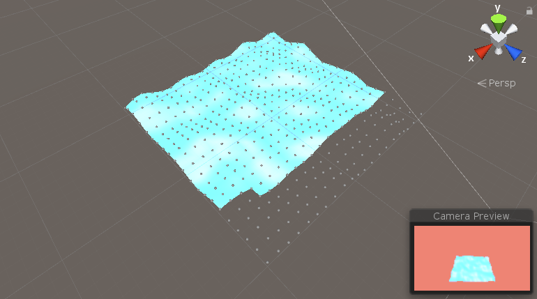
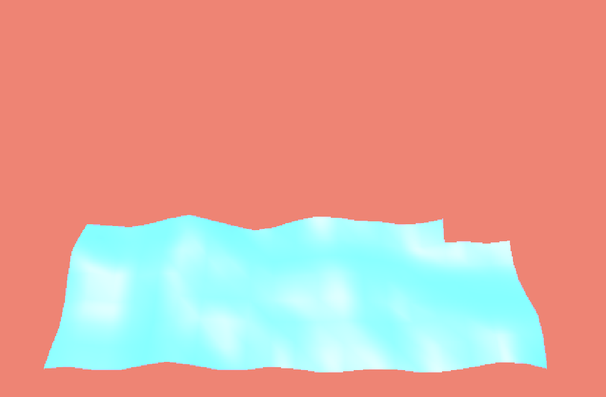

# proceduralTerrain
Just made an algorithm to create random imperfections on the terrain

Going to be using radom library to simulate wave pattern in the near future. 
This script can be used to generate large psuedo randomly generated terrain.

